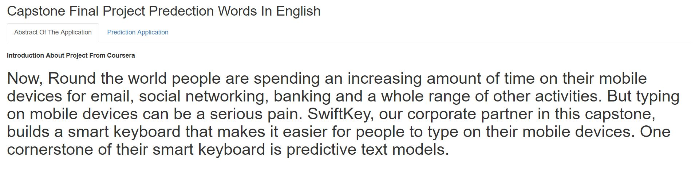
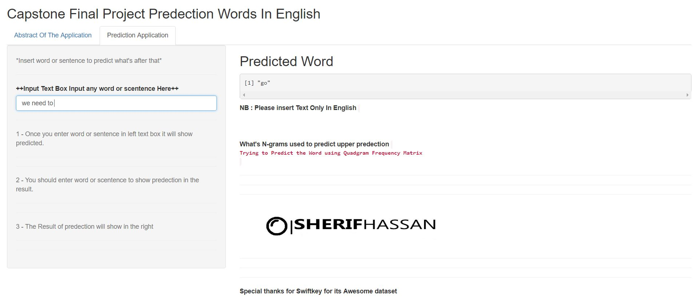

Capstone Final Project Presentation
========================================================
author: Sherif Hassan
date: 9-2-2018
autosize: true

First Slide
========================================================

For inquiry for Prediction Shiny Application please visit <https://sherifhassan.shinyapps.io/CapstoneShinyApp/>.

- This is application from NLP (Natural Language Processing) applications in the practical life 

- Many of us waste alot of time in writing many words in his life that this app help us to save our time and less percentage of writing spelling due to good corpus 

- This Capstone, Swiftkey Co. is Partener with Coursera with it's Dataset.

Overview
========================================================

- Main Obkective from this Project is implement app such used in smart phones Ex. Swiftkey keaboard.

- Implementation Steps:

* Analysis for the problem : we need an tool that predict words depends on knowledge data

* Clean this data from sweart words to be more proffisoinal with users

* Make an Exploratory data analysis to know the statistics about the data 

- The data was cleaned, processed, tokenized, and n-grams are created. 

- Final Milestone Report [Milestone Report](http://rpubs.com/sherifhassan/355763).

- Extract RData files for (Unigram,Bigram,Trigram,Quadgram) by saveRDS(unigram | Bigram | Trigram | Quadgram, file = "unigram.RData") to use it in prediction function

Slide With Plot
========================================================

* The Shiny application allow the prediction of the next possible word in a sentence. 

* The user entered the text in an input box, and in the other one, the application returns the most probability word to be used.

* The predicted word is obtained from the n-grams matrices, comparing it with tokenized frequency of 2, 3 and 4 grams sequences. 

* While entering the text, the field with the predicted next word refreshes instantaneously, and then the predicted word is then provided for the user's choice. 

GUI --> Graphical User Interface - A
========================================================

* Print screen of the Shiny app abstract .

GUI --> Graphical User Interface - B
========================================================

* Print screen of the Shiny app Implementation .

* input one word or more and prediction will show in the right box and usage ngram will shou below output of predection. 

Comments 
========================================================

* it can be revamping by increase sample of data by increase set.seed(No). 

* Application in [shinyapp.io](https://sherifhassan.shinyapps.io/CapstoneShinyApp/)

* this presentation in [Pitch Deck](http://rpubs.com/)

